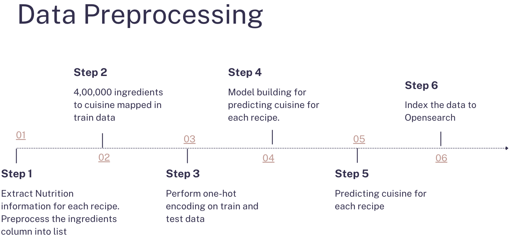
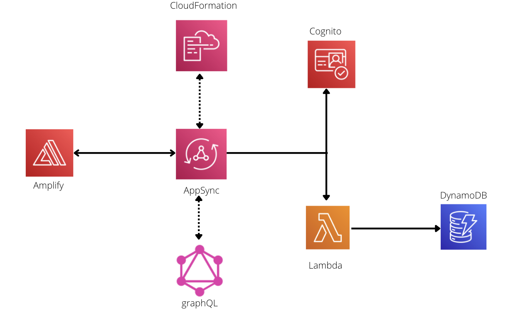
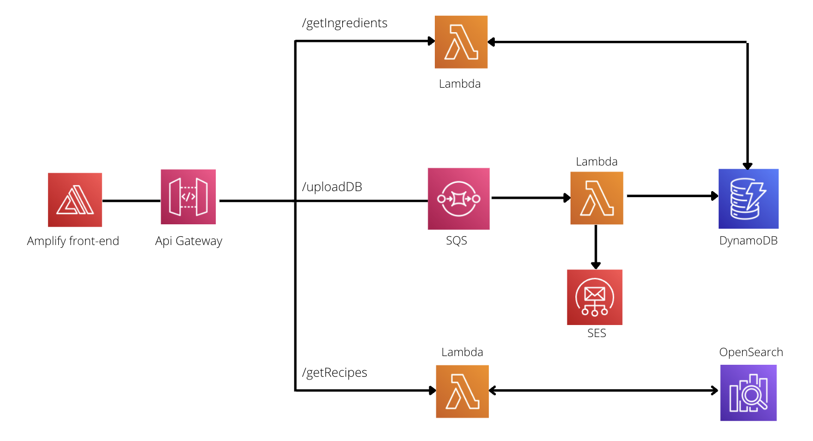
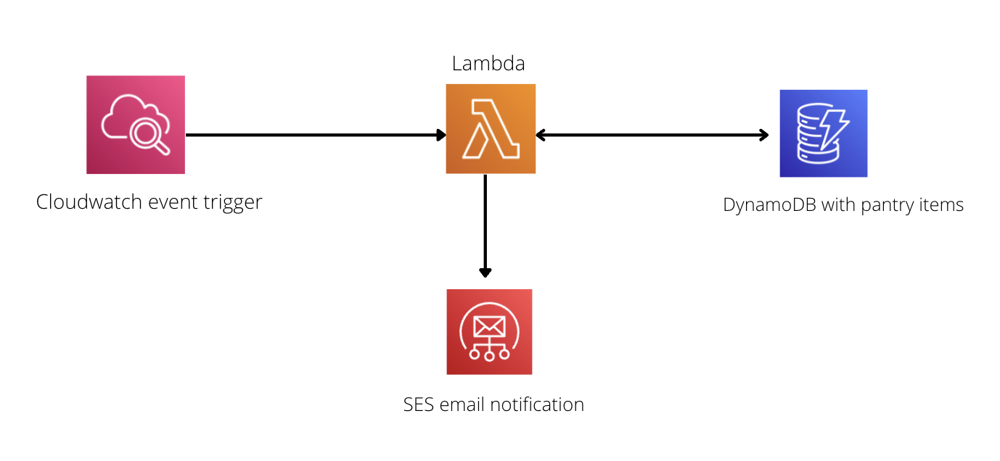

# Bon Appetit 

Link to the website hosted on Amplify - https://master.d3guniqzi1yi8m.amplifyapp.com/

## Problem Statement 

As students who have began cooking for ourselves recently, it is confusing to think about what to cook and how to cook everyday. Oftentimes there is a long thought process in our head that has to factor in what is available at home and how to cook it. 

## Solution 

Bon Appetit is a website where users can create their own login profile and add food ingredients to their pantry as and when they buy it and attach it with an approximate expiry. Every time the user logs in, they will be able to see the food available in their pantry, click on the ingredients they feel like eating today and get delicious recipes that they can make out of it.

## What is our data??

1. 45,000 recipes
2. 20 Different cuisines
3. 400000 Ingredients

Preprocessing on Data : 
Data is selected from kaggle https://www.kaggle.com/datasets/elisaxxygao/foodrecsysv1?select=core-data_recipe.csv

The data did not have cuisine information. So, we predicted the cuisine for each of the 45000 recipes using a Machine Learning Model. 
Once the data has all the cuisine information, we have indexed the data to Opensearch for searching based on user's preference. 

#### Features

1. Login and Dashboard
2. Select Ingredients and Search
3. Filter based on Cuisine
4. Add to Pantry
5. Expiry Notification

## Tech Stack

1. React 18.1.0 for Front end
   
2. Python 3.8 for Lambda and Pre-Processing

## Architecture 

1. Front-End Architecture :

The front end application is implemented using React and hosted on Amplify. Through Appsync, it connects to Cloud Formation, Lambda function. 
The lambda function is connected to DynamoDB to store user information. 
   

2. Back-End Architecture 

Front-end hosted on Amplify conencts to API Gateway where we have three API calls. 

/getIngredients - This retrieves the ingredients in user's pantry.  
/uploadDB - This API connects to SQS and the messages from SQS will be uploaded to DynamoDB for user-specific pantry. The lambda function also sends mails to the users if the ingredient they added is expiring today.  
/getRecipes - This API connects to lambda and retrieves the search results from Opensearch based on the user selected ingredients.  

3. Expiry Monitor Architecture

A feature we have added to monitor the expiration of ingredients. The cloud watch triggers a Lambda function to check the expiry date of all the ingredients in every user's pantry and sends them an email to remind them to check the app for recipes expiring today. 

## Working

1. Login 
   
.gif)

2. Selecting Ingredients 
   
.gif)

3. Getting Recipes
   
.gif)

4. Adding to Pantry
   
.gif)

5. Viewing Newly Added Ingredients
   
.gif)

* * *

This project was bootstrapped with [Create React App](https://github.com/facebook/create-react-app).
In the project directory, you can run:

##### `npm start`
Runs the app in the development mode.\
Open [http://localhost:3000](http://localhost:3000) to view it in your browser.

The page will reload when you make changes.\
You may also see any lint errors in the console.

##### `npm test`

Launches the test runner in the interactive watch mode.\
See the section about [running tests](https://facebook.github.io/create-react-app/docs/running-tests) for more information.

##### `npm run build`

Builds the app for production to the `build` folder.\
It correctly bundles React in production mode and optimizes the build for the best performance.

The build is minified and the filenames include the hashes.\
Your app is ready to be deployed!

See the section about [deployment](https://facebook.github.io/create-react-app/docs/deployment) for more information.

